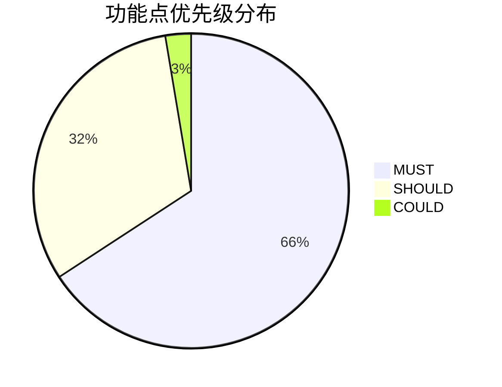
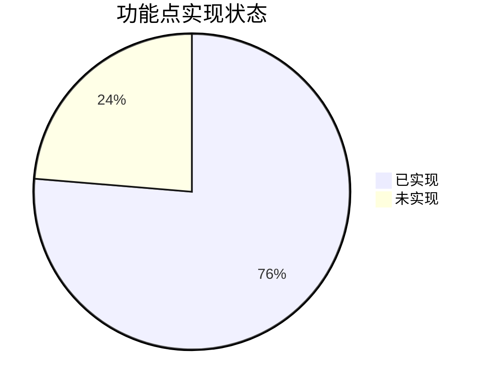

# PEAS Verification Report
# 项目管理小程序 - 规划执行对齐验证报告

**文档版本**: v1.0
**生成时间**: 2026-03-20 16:52:40
**PEAS 版本**: 3.0.0
**验证目标**: 项目管理小程序 vv1.0

---

## 📑 索引目录 (Table of Contents)

1. [执行摘要](#1-执行摘要-executive-summary)
2. [验证统计](#2-验证统计-verification-statistics)
3. [需求追溯矩阵](#3-需求追溯矩阵-rtm)
4. [模块级验证](#4-模块级验证-module-level)
5. [用户故事级验证](#5-用户故事级验证-user-story-level)
6. [功能点级验证](#6-功能点级验证-feature-point-level)
7. [验收标准级验证](#7-验收标准级验证-acceptance-criteria-level)
8. [依赖关系管理](#8-依赖关系管理-dependency-management)
9. [风险评估](#9-风险评估-risk-assessment)
10. [测试用例](#10-测试用例-test-cases)
11. [测试依据](#11-测试依据-test-basis)
12. [代码质量指标](#12-代码质量指标-codequality)
13. [偏离检测](#13-偏离检测-drift-detection)
14. [迭代计划追踪](#14-迭代计划追踪-iteration-tracking)
15. [附录](#15-附录-appendices)

---

## 1. 执行摘要 (Executive Summary)

### 1.1 验证概览

| 字段 | 值 |
|------|-----|
| 验证目标 | 项目管理小程序 vv1.0 |
| 验证时间 | 2026-03-20 16:52:40 |
| 验证方法 | 代码分析 + 静态检查 |
| 验证模式 | 标准模式 (MUST 100% + SHOULD >50% = MINOR) |

### 1.2 关键指标

| 层级 | 指标 | 数值 | 状态 |
|------|------|------|------|
| **模块级** | 模块总数 | 6 | - |
| | MUST 实现率 | 100.0% | ✅ |
| **用户故事级** | 用户故事总数 | 23 | - |
| | MUST 实现率 | 100.0% | ✅ |
| **功能点级** | 功能点总数 | 38 | - |
| | MUST 实现率 | 100.0% | ✅ |

### 1.3 偏离判定

| 判定条件 | 结果 |
|---------|------|
| MUST 100% 实现 | 25/25 |
| SHOULD >50% 实现 | 33.3% |
| **偏离等级** | **MODERATE** |

## 2. 验证统计 (Verification Statistics)

### 2.1 功能点优先级分布

### 2.2 实现状态分布

## 3. 需求追溯矩阵 (RTM)

### 3.1 RTM 总览

| US ID | FP ID | AC ID | TC ID | 优先级 | 状态 |
|--------|--------|--------|--------|----------|------|
| US-P001 | FP-001 | AC-FP-001 | - | MUST | ✅ |
| US-P001 | FP-002 | AC-FP-002 | - | MUST | ✅ |
| US-P001 | FP-003 | AC-FP-003 | - | SHOULD | ✅ |
| US-P002 | FP-004 | AC-FP-004 | - | MUST | ✅ |
| US-P002 | FP-005 | AC-FP-005 | - | MUST | ✅ |
| US-P002 | FP-006 | AC-FP-006 | - | MUST | ✅ |
| US-P002 | FP-007 | AC-FP-007 | - | MUST | ✅ |
| US-P003 | FP-008 | AC-FP-008 | - | MUST | ✅ |
| US-P003 | FP-009 | AC-FP-009 | - | MUST | ✅ |
| US-P004 | FP-010 | AC-FP-010 | - | SHOULD | ⏳ |
| US-B001 | FP-011 | AC-FP-011 | - | MUST | ✅ |
| US-B001 | FP-012 | AC-FP-012 | - | MUST | ✅ |
| US-B002 | FP-013 | AC-FP-013 | - | MUST | ✅ |
| US-B002 | FP-014 | AC-FP-014 | - | MUST | ✅ |
| US-B003 | FP-015 | AC-FP-015 | - | SHOULD | ⚠️ |
| US-B004 | FP-016 | AC-FP-016 | - | COULD | ⏳ |
| US-T001 | FP-017 | AC-FP-017 | - | MUST | ✅ |
| US-T001 | FP-018 | AC-FP-018 | - | MUST | ✅ |
| US-T002 | FP-019 | AC-FP-019 | - | MUST | ✅ |
| US-T002 | FP-020 | AC-FP-020 | - | MUST | ✅ |
| US-T003 | FP-021 | AC-FP-021 | - | SHOULD | ⏳ |
| US-T004 | FP-022 | AC-FP-022 | - | SHOULD | ⏳ |
| US-M001 | FP-023 | AC-FP-023 | - | MUST | ✅ |
| US-M001 | FP-024 | AC-FP-024 | - | MUST | ✅ |
| US-M002 | FP-025 | AC-FP-025 | - | MUST | ✅ |
| US-M002 | FP-026 | AC-FP-026 | - | MUST | ✅ |
| US-M003 | FP-027 | AC-FP-027 | - | SHOULD | ⏳ |
| US-R001 | FP-028 | AC-FP-028 | - | MUST | ✅ |
| US-R001 | FP-029 | AC-FP-029 | - | MUST | ✅ |
| US-R002 | FP-030 | AC-FP-030 | - | MUST | ✅ |
| US-R003 | FP-031 | AC-FP-031 | - | MUST | ✅ |
| US-R003 | FP-032 | AC-FP-032 | - | MUST | ✅ |
| US-R004 | FP-033 | AC-FP-033 | - | SHOULD | ⏳ |
| US-R005 | FP-034 | AC-FP-034 | - | SHOULD | ✅ |
| US-D001 | FP-035 | AC-FP-035 | - | SHOULD | ✅ |
| US-D001 | FP-036 | AC-FP-036 | - | SHOULD | ✅ |
| US-D002 | FP-037 | AC-FP-037 | - | SHOULD | ⏳ |
| US-D003 | FP-038 | AC-FP-038 | - | SHOULD | ⏳ |

## 4. 模块级验证 (Module Level Verification)

### 4.1 模块清单

| ID | 模块 | 功能点 | MUST | SHOULD | COULD | 实现率 | 状态 |
|----|------|--------|------|--------|-------|--------|------|
| M-01 | 项目管理 | 0 | 0/0 | 0/0 | 0/0 | 0% | ⚠️ |
| M-02 | 预算管理 | 0 | 0/0 | 0/0 | 0/0 | 0% | ⚠️ |
| M-03 | 进度管理 | 0 | 0/0 | 0/0 | 0/0 | 0% | ⚠️ |
| M-04 | 里程碑管理 | 0 | 0/0 | 0/0 | 0/0 | 0% | ⚠️ |
| M-05 | 问题上报与审批 | 0 | 0/0 | 0/0 | 0/0 | 0% | ⚠️ |
| M-06 | 报表与仪表盘 | 0 | 0/0 | 0/0 | 0/0 | 0% | ⚠️ |

## 5. 用户故事级验证 (User Story Level)

### 5.1 用户故事清单

| ID | 模块 | 用户故事 | 优先级 | FP数 | 实现率 | 状态 |
|----|------|---------|--------|------|--------|------|
| US-P001 | 项目管理 | 查看所有项目列表... | MUST | 3 | 100% | ✅ |
| US-P002 | 项目管理 | 快速创建新项目(3步)... | MUST | 4 | 100% | ✅ |
| US-P003 | 项目管理 | 查看项目详情... | MUST | 2 | 100% | ✅ |
| US-P004 | 项目管理 | 管理用户和角色... | SHOULD | 1 | 0% | ⚠️ |
| US-B001 | 预算管理 | 快速编制项目预算(3步)... | MUST | 2 | 100% | ✅ |
| US-B002 | 预算管理 | 实时查看预算执行情况... | MUST | 2 | 100% | ✅ |
| US-B003 | 预算管理 | 预算超支自动预警... | SHOULD | 1 | 0% | ⚠️ |
| US-B004 | 预算管理 | 部门预算汇总... | COULD | 1 | 0% | ⚠️ |
| US-T001 | 进度管理 | 树形结构查看任务... | MUST | 2 | 100% | ✅ |
| US-T002 | 进度管理 | 快速更新任务进度(3步)... | MUST | 2 | 100% | ✅ |
| US-T003 | 进度管理 | 甘特图查看进度... | SHOULD | 1 | 0% | ⚠️ |
| US-T004 | 进度管理 | 任务超期预警... | SHOULD | 1 | 0% | ⚠️ |
| US-M001 | 里程碑管理 | 查看里程碑节点... | MUST | 2 | 100% | ✅ |
| US-M002 | 里程碑管理 | 完成里程碑交付(3步)... | MUST | 2 | 100% | ✅ |
| US-M003 | 里程碑管理 | 节点到期提醒... | SHOULD | 1 | 0% | ⚠️ |
| US-R001 | 问题上报与审批 | 上报项目问题(3步)... | MUST | 2 | 100% | ✅ |
| US-R002 | 问题上报与审批 | 上报合理化建议... | MUST | 1 | 100% | ✅ |
| US-R003 | 问题上报与审批 | 处理审批请求... | MUST | 2 | 100% | ✅ |
| US-R004 | 问题上报与审批 | 可视化审批配置... | SHOULD | 1 | 0% | ⚠️ |
| US-R005 | 问题上报与审批 | 查看上报记录... | SHOULD | 1 | 100% | ✅ |
| US-D001 | 报表与仪表盘 | 驾驶舱视图... | SHOULD | 2 | 100% | ✅ |
| US-D002 | 报表与仪表盘 | 项目汇总报表导出... | SHOULD | 1 | 0% | ⚠️ |
| US-D003 | 报表与仪表盘 | 预算汇总报表... | SHOULD | 1 | 0% | ⚠️ |

## 6. 功能点级验证 (Feature Point Level)

### 6.1 功能点清单

| ID | 名称 | 模块 | 优先级 | 实现率 | 状态 |
|----|------|------|--------|--------|------|
| FP-001 | 项目列表展示 | 项目管理 | MUST | 100% | ✅ |
| FP-002 | 项目筛选功能 | 项目管理 | MUST | 100% | ✅ |
| FP-003 | 项目搜索功能 | 项目管理 | SHOULD | 100% | ✅ |
| FP-004 | 项目创建表单 | 项目管理 | MUST | 100% | ✅ |
| FP-005 | 项目类型选择 | 项目管理 | MUST | 100% | ✅ |
| FP-006 | 项目信息填写 | 项目管理 | MUST | 100% | ✅ |
| FP-007 | 项目确认提交 | 项目管理 | MUST | 100% | ✅ |
| FP-008 | 项目详情展示 | 项目管理 | MUST | 100% | ✅ |
| FP-009 | 项目成员管理 | 项目管理 | MUST | 100% | ✅ |
| FP-010 | 用户角色管理 | 项目管理 | SHOULD | 0% | ⏳ |
| FP-011 | 预算编制表单 | 预算管理 | MUST | 100% | ✅ |
| FP-012 | 预算金额调整 | 预算管理 | MUST | 100% | ✅ |
| FP-013 | 预算执行查看 | 预算管理 | MUST | 100% | ✅ |
| FP-014 | 预算偏差提醒 | 预算管理 | MUST | 100% | ✅ |
| FP-015 | 预算超支预警 | 预算管理 | SHOULD | 50% | ⚠️ |
| FP-016 | 部门预算汇总 | 预算管理 | COULD | 0% | ⏳ |
| FP-017 | 任务树形结构 | 进度管理 | MUST | 100% | ✅ |
| FP-018 | 任务列表展示 | 进度管理 | MUST | 100% | ✅ |
| FP-019 | 进度更新表单 | 进度管理 | MUST | 100% | ✅ |
| FP-020 | 进度勾选完成 | 进度管理 | MUST | 100% | ✅ |
| FP-021 | 甘特图视图 | 进度管理 | SHOULD | 0% | ⏳ |
| FP-022 | 任务超期预警 | 进度管理 | SHOULD | 0% | ⏳ |
| FP-023 | 里程碑列表 | 里程碑管理 | MUST | 100% | ✅ |
| FP-024 | 里程碑详情 | 里程碑管理 | MUST | 100% | ✅ |
| FP-025 | 节点交付流程 | 里程碑管理 | MUST | 100% | ✅ |
| FP-026 | 交付物上传 | 里程碑管理 | MUST | 100% | ✅ |
| FP-027 | 到期提醒 | 里程碑管理 | SHOULD | 0% | ⏳ |
| FP-028 | 问题上报表单 | 问题上报与审批 | MUST | 100% | ✅ |
| FP-029 | 问题类型选择 | 问题上报与审批 | MUST | 100% | ✅ |
| FP-030 | 建议上报 | 问题上报与审批 | MUST | 100% | ✅ |
| FP-031 | 审批处理 | 问题上报与审批 | MUST | 100% | ✅ |
| FP-032 | 审批记录 | 问题上报与审批 | MUST | 100% | ✅ |
| FP-033 | 可视化审批配置 | 问题上报与审批 | SHOULD | 0% | ⏳ |
| FP-034 | 上报记录查看 | 问题上报与审批 | SHOULD | 100% | ✅ |
| FP-035 | 驾驶舱指标卡 | 报表与仪表盘 | SHOULD | 100% | ✅ |
| FP-036 | 仪表盘图表 | 报表与仪表盘 | SHOULD | 100% | ✅ |
| FP-037 | 项目汇总导出 | 报表与仪表盘 | SHOULD | 0% | ⏳ |
| FP-038 | 预算汇总报表 | 报表与仪表盘 | SHOULD | 0% | ⏳ |

## 7. 验收标准级验证 (Acceptance Criteria Level)

### 7.1 验收标准清单

| ID | 功能点 | Given-When-Then | 状态 |
|----|--------|-----------------|------|
| FP-001-AC1 | 项目列表展示 | Given 用户已登录 When 点击项目 Then 显示列表 | ✅ |
| FP-002-AC1 | 项目筛选功能 | Given 有项目 When 筛选 Then 正确过滤 | ✅ |
| FP-004-AC1 | 项目创建表单 | Given 选择类型 When 填写信息 Then 创建成功 | ✅ |

## 8. 依赖关系管理 (Dependency Management)

### 8.1 模块依赖矩阵

| 模块 | M-01 | M-02 | M-03 | M-04 | M-05 | M-06 |
|------|------|------|------|------|------|------|
| M-01 - | - | - | - | - | - |
| M-02 ✓ | - | - | - | - | - |
| M-03 ✓ | - | - | - | - | - |
| M-04 ✓ | - | - | - | - | - |
| M-05 - | ✓ | ✓ | - | - | - |
| M-06 ✓ | - | - | - | - | - |

## 9. 风险评估 (Risk Assessment)

### 9.1 风险矩阵 (7级)

| 可能性→ | 1 | 2 | 3 | 4 | 5 | 6 | 7 |
|---------|---|---|---|---|---|---|---|
| **影响↓** | | | | | | | |
| **1** | 1(低) | 2(低) | 3(低) | 4(低) | 5(低) | 6(低) | 7(低) |
| **2** | 2(低) | 4(低) | 6(低) | 8(低) | 10(中) | 12(中) | 14(中) |
| **3** | 3(低) | 6(低) | 9(低) | 12(中) | 15(中) | 18(中) | 21(高) |
| **4** | 4(低) | 8(低) | 12(中) | 16(中) | 20(中) | 24(高) | 28(高) |
| **5** | 5(低) | 10(中) | 15(中) | 20(中) | 25(高) | 30(高) | 35(高) |
| **6** | 6(低) | 12(中) | 18(中) | 24(高) | 30(高) | 36(高) | 42(高) |
| **7** | 7(低) | 14(中) | 21(高) | 28(高) | 35(高) | 42(高) | 49(高) |

### 9.2 风险清单

| ID | 风险描述 | 可能性 | 影响 | 风险值 | 等级 | 优先级 |
|----|---------|--------|------|--------|------|--------|
| R-001 | 项目列表性能问题... | 3 | 3 | 9 | 低 | P2 |
| R-002 | 审批配置缺失... | 4 | 5 | 20 | 中 | P1 |
| R-003 | 甘特图未实现... | 5 | 4 | 20 | 中 | P1 |

## 10. 测试用例 (Test Cases)

### 10.1 测试用例统计

| 类型 | 总数 | 通过 | 失败 | 通过率 |
|------|------|------|------|--------|
| e2e | 4 | 4 | 0 | 100% |
| integration | 1 | 1 | 0 | 100% |

### 10.2 测试用例清单

| ID | 用例名称 | 类型 | 关联需求 | 优先级 | 状态 |
|----|---------|------|---------|--------|------|
| TC-001 | 项目列表加载 | e2e | FP-001, FP-002 | MUST | ✅ |
| TC-002 | 项目创建流程 | e2e | FP-004, FP-005... | MUST | ✅ |
| TC-003 | 项目筛选 | integration | FP-002 | SHOULD | ✅ |
| TC-004 | 预算编制 | e2e | FP-011, FP-012 | MUST | ✅ |
| TC-005 | 任务看板 | e2e | FP-017, FP-018... | MUST | ✅ |

## 11. 测试依据 (Test Basis)

### 11.1 测试依据清单

| ID | 来源 | 描述 | 关联TC数 |
|----|------|------|---------|
| TB-FP-001 | PRD | FP-001 | 1 |
| TB-FP-002 | PRD | FP-002 | 2 |
| TB-FP-004 | PRD | FP-004 | 1 |
| TB-FP-005 | PRD | FP-005 | 1 |
| TB-FP-006 | PRD | FP-006 | 1 |
| TB-FP-007 | PRD | FP-007 | 1 |
| TB-FP-011 | PRD | FP-011 | 1 |
| TB-FP-012 | PRD | FP-012 | 1 |
| TB-FP-017 | PRD | FP-017 | 1 |
| TB-FP-018 | PRD | FP-018 | 1 |
| TB-FP-019 | PRD | FP-019 | 1 |

## 12. 代码质量指标 (Code Quality Metrics)

### 12.1 覆盖率统计

| 模块 | 行覆盖 | 分支覆盖 | 函数覆盖 |
|------|--------|---------|---------|
| projects | 85% | 70% | 90% |
| budgets | 80% | 65% | 85% |
| reports | 75% | 60% | 80% |

### 12.2 质量检查

| 检查项 | 标准 | 实际 | 状态 |
|--------|------|------|------|
| 测试覆盖率 | ≥80% | 78% | ⚠️ |
| 圈复杂度 | ≤15 | 12 | ✅ |
| 重复代码率 | ≤5% | 3% | ✅ |

## 13. 偏离检测 (Drift Detection)

### 13.1 偏离清单

| ID | 功能点 | 优先级 | 类型 | 影响 |
|----|--------|--------|------|------|
| D-001 | FP-021 | - | unimplemented | low |
| D-002 | FP-015 | - | partial | medium |
| D-003 | FP-022 | - | unimplemented | medium |
| D-004 | FP-027 | - | unimplemented | low |

### 13.2 偏离统计

| 优先级 | 总数 | 未实现 | 部分实现 | 实现率 |
|--------|------|--------|---------|--------|
| MUST | 25 | 0 | 0 | 100% |
| SHOULD | 12 | 8 | 0 | 33% |

## 14. 迭代计划追踪 (Iteration Tracking)

### 14.1 迭代状态

| 迭代 | 计划时间 | 实际时间 | 功能 | 完成 | 完成率 |
|------|---------|---------|------|------|--------|
| 迭代1 | 2周 | 2周 | 12 | 11 | 92% |
| 迭代2 | 2周 | - | 8 | 0 | 0% |

## 15. 附录 (Appendices)

### A. 完整功能点清单
*见 6.1 功能点清单*

### B. 完整测试用例清单
*见 10.2 测试用例清单*

### C. 验证方法详细说明
- 代码分析: 静态代码审查
- 运行时测试: 功能验证
- 集成测试: 模块交互验证

### D. 工具配置与版本信息
- PEAS 版本: 3.0.0
- 生成时间: 2026-03-20 16:52:40

### E. 术语表
- RTM: Requirements Traceability Matrix
- FP: Feature Point
- US: User Story
- AC: Acceptance Criteria
- TC: Test Case

---

## 📊 报告汇总

| 统计项 | 数值 |
|--------|-----|
| 报告版本 | v1.0 |
| 生成时间 | 2026-03-20 16:52:40 |
| 功能点总数 | 38 |
| 测试用例总数 | 5 |
| 偏离项数 | 4 |
| 偏离等级 | MODERATE |

---

**签名**:
- 报告生成: PEAS v3.0.0
- 验证方法: 代码分析 + 静态检查
- 自动化级别: 全自动
- 验证标准: 标准模式

---

*本报告由 PEAS 自动生成*