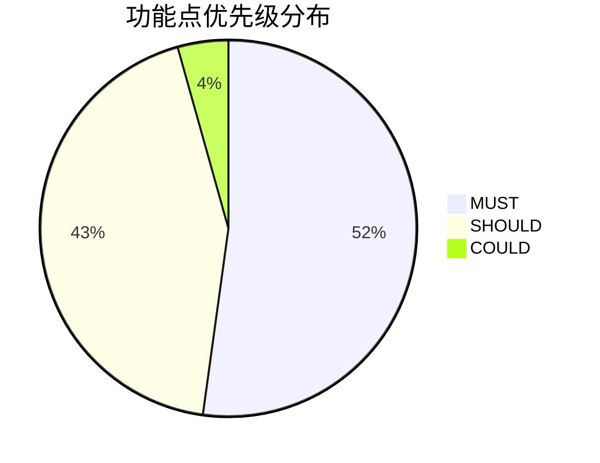
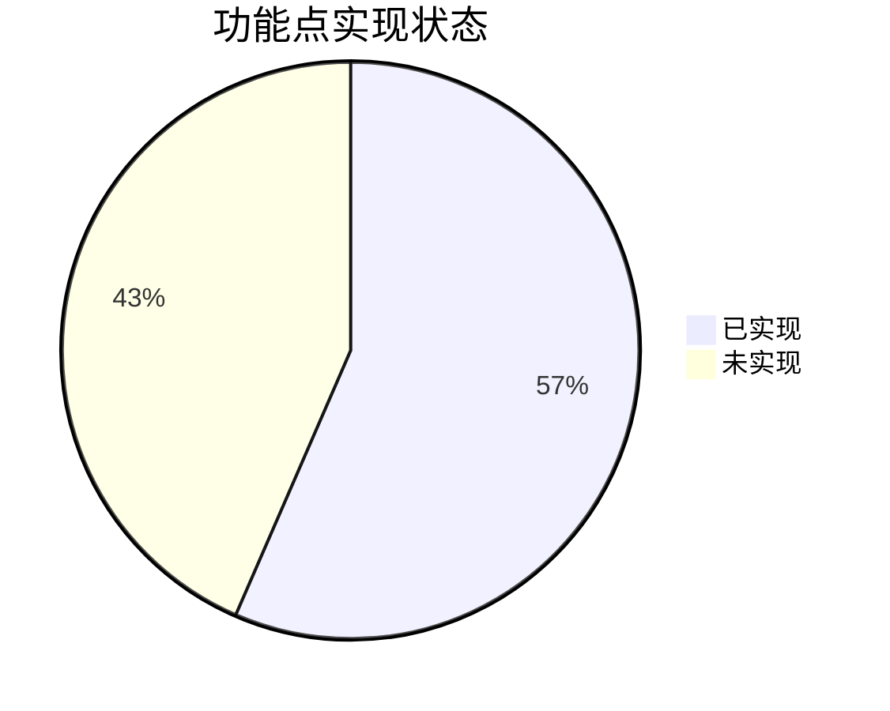

# PEAS Verification Report
# 项目

| 字段 | 值 |
|------|-----|
| 文档版本 | v1.0 |
| 生成时间 | 2026-03-20 23:45:32 |
| PEAS 版本 | 3.0.0 |
| 验证目标 | v1.0 |

---

## 索引目录 (Table of Contents)

1. [执行摘要](#1-执行摘要)
2. [验证统计](#2-验证统计)
3. [需求追溯矩阵](#3-需求追溯矩阵-rtm)
4. [模块级验证](#4-模块级验证)
5. [用户故事级验证](#5-用户故事级验证)
6. [功能点级验证](#6-功能点级验证)
7. [验收标准级验证](#7-验收标准级验证)
8. [依赖关系管理](#8-依赖关系管理)
9. [风险评估](#9-风险评估)
10. [测试用例](#10-测试用例)
11. [偏离检测](#11-偏离检测)
12. [附录](#12-附录)

---

## 1. 执行摘要

### 1.1 验证概览

| 字段 | 值 |
|------|-----|
| 验证目标 | v1.0 |
| 验证时间 | 2026-03-20 23:45:32 |
| 验证方法 | 代码分析 + 静态检查 |
| 验证模式 | 标准模式 (MUST 100% + SHOULD >50% = MINOR) |

### 1.2 关键指标

| 层级 | 指标 | 数值 | 状态 |
|------|------|------|------|
| **模块级** | 模块总数 | 6 | - |
| | MUST 实现率 | 91.7% | ⚠️ |
| **用户故事级** | 用户故事总数 | 23 | - |
| | MUST 实现率 | 91.7% | ⚠️ |
| **功能点级** | 功能点总数 | 23 | - |
| | MUST 实现率 | 91.7% | ⚠️ |

### 1.3 偏离判定

| 判定条件 | 结果 |
|---------|------|
| MUST 100% 实现 | 11/12 |
| SHOULD >50% 实现 | 20.0% |
| **偏离等级** | **MODERATE** |
| 偏离原因 | MUST实现率91.7% < 100% |

---

## 2. 验证统计

### 2.1 功能点优先级分布

### 2.2 实现状态分布

---

## 3. 需求追溯矩阵 (RTM)

### 3.1 RTM 总览

| US ID | FP ID | AC ID | 优先级 | 状态 |
|--------|--------|--------|----------|------|
| US-P001 | FP-P001-01 | FP-P001-01-AC1 | MUST | ✅ |
| US-P002 | FP-P002-01 | FP-P002-01-AC1 | MUST | ✅ |
| US-P003 | FP-P003-01 | FP-P003-01-AC1 | MUST | ✅ |
| US-P004 | FP-P004-01 | FP-P004-01-AC1 | SHOULD | ⏳ |
| US-B001 | FP-B001-01 | FP-B001-01-AC1 | MUST | ✅ |
| US-B002 | FP-B002-01 | FP-B002-01-AC1 | MUST | ✅ |
| US-B003 | FP-B003-01 | FP-B003-01-AC1 | SHOULD | ⚠️ |
| US-B004 | FP-B004-01 | FP-B004-01-AC1 | COULD | ⏳ |
| US-T001 | FP-T001-01 | FP-T001-01-AC1 | MUST | ⚠️ |
| US-T002 | FP-T002-01 | FP-T002-01-AC1 | MUST | ✅ |
| US-T003 | FP-T003-01 | FP-T003-01-AC1 | SHOULD | ⏳ |
| US-T004 | FP-T004-01 | FP-T004-01-AC1 | SHOULD | ⏳ |
| US-M001 | FP-M001-01 | FP-M001-01-AC1 | MUST | ✅ |
| US-M002 | FP-M002-01 | FP-M002-01-AC1 | MUST | ✅ |
| US-M003 | FP-M003-01 | FP-M003-01-AC1 | SHOULD | ⏳ |
| US-R001 | FP-R001-01 | FP-R001-01-AC1 | MUST | ✅ |
| US-R002 | FP-R002-01 | FP-R002-01-AC1 | MUST | ✅ |
| US-R003 | FP-R003-01 | FP-R003-01-AC1 | MUST | ✅ |
| US-R004 | FP-R004-01 | FP-R004-01-AC1 | SHOULD | ⚠️ |
| US-R005 | FP-R005-01 | FP-R005-01-AC1 | SHOULD | ✅ |
| ... | ... | ... | ... | ... |

---

## 4. 模块级验证

| ID | 模块 | 用户故事数 | 功能点数 | MUST | SHOULD | COULD |
|----|------|---------|---------|------|--------|-------|
| M-PM | 项目管理 | 4 | 0 | 0 | 0 | 0 |
| M-BM | 预算管理 | 4 | 0 | 0 | 0 | 0 |
| M-TM | 进度管理 | 4 | 0 | 0 | 0 | 0 |
| M-MM | 里程碑管理 | 3 | 0 | 0 | 0 | 0 |
| M-RM | 问题上报与审批 | 5 | 0 | 0 | 0 | 0 |
| M-DM | 报表与仪表盘 | 3 | 0 | 0 | 0 | 0 |

---

## 5. 用户故事级验证

| ID | 模块 | 用户故事 | 优先级 | 功能点数 | 实现率 |
|----|------|---------|--------|--------|--------|
| US-P001 | 项目管理 | 作为项目管理人员，我希望查看所有项目列表... | MUST | 1 | 100% |
| US-P002 | 项目管理 | 作为项目管理人员，我希望快速创建新项目（3步内）... | MUST | 1 | 100% |
| US-P003 | 项目管理 | 作为项目负责人，我希望查看项目的详细信息... | MUST | 1 | 100% |
| US-P004 | 项目管理 | 作为系统管理员，我希望管理用户和角色... | SHOULD | 1 | 0% |
| US-B001 | 预算管理 | 作为项目负责人，我希望快速编制项目预算（3步内）... | MUST | 1 | 100% |
| US-B002 | 预算管理 | 作为项目负责人，我希望实时查看预算执行情况... | MUST | 1 | 100% |
| US-B003 | 预算管理 | 作为系统，我希望在预算超支时自动预警... | SHOULD | 1 | 0% |
| US-B004 | 预算管理 | 作为财务人员，我希望按部门汇总预算执行情况... | COULD | 1 | 0% |
| US-T001 | 进度管理 | 作为项目成员，我希望以树形结构查看项目任务... | MUST | 1 | 0% |
| US-T002 | 进度管理 | 作为项目成员，我希望快速更新任务进度（3步内）... | MUST | 1 | 100% |
| US-T003 | 进度管理 | 作为项目负责人，我希望以甘特图查看项目进度... | SHOULD | 1 | 0% |
| US-T004 | 进度管理 | 作为系统，我希望在任务超期时自动预警... | SHOULD | 1 | 0% |
| US-M001 | 里程碑管理 | 作为项目负责人，我希望查看项目的所有里程碑节点... | MUST | 1 | 100% |
| US-M002 | 里程碑管理 | 作为项目成员，我希望完成里程碑节点的交付（3步内）... | MUST | 1 | 100% |
| US-M003 | 里程碑管理 | 作为系统，我希望在节点到期时自动提醒... | SHOULD | 1 | 0% |
| US-R001 | 问题上报与审批 | 作为项目成员，我希望上报项目问题，只需3步... | MUST | 1 | 100% |
| US-R002 | 问题上报与审批 | 作为项目成员，我希望上报合理化建议... | MUST | 1 | 100% |
| US-R003 | 问题上报与审批 | 作为审批人，我希望处理审批请求... | MUST | 1 | 100% |
| US-R004 | 问题上报与审批 | 作为系统管理员，我希望可视化配置审批流程... | SHOULD | 1 | 0% |
| US-R005 | 问题上报与审批 | 作为上报人，我希望查看我的上报记录和审批进度... | SHOULD | 1 | 100% |
| US-D001 | 报表与仪表盘 | 作为项目管理人员，我希望在一个页面看到项目的关键指标... | SHOULD | 1 | 100% |
| US-D002 | 报表与仪表盘 | 作为管理层，我希望查看项目汇总报表，支持导出Excel... | SHOULD | 1 | 0% |
| US-D003 | 报表与仪表盘 | 作为财务人员，我希望查看预算汇总报表... | SHOULD | 1 | 0% |

---

## 6. 功能点级验证

| ID | 名称 | 模块 | 优先级 | 实现率 | 状态 |
|----|------|------|--------|--------|------|
| FP-P001-01 | 项目列表展示 | 项目管理 | MUST | 100% | ✅ |
| FP-P002-01 | 3步创建向导 | 项目管理 | MUST | 100% | ✅ |
| FP-P003-01 | 项目详情展示 | 项目管理 | MUST | 100% | ✅ |
| FP-P004-01 | 用户角色管理 | 项目管理 | SHOULD | 0% | ⏳ |
| FP-B001-01 | 预算编制流程 | 预算管理 | MUST | 100% | ✅ |
| FP-B002-01 | 预算执行监控 | 预算管理 | MUST | 100% | ✅ |
| FP-B003-01 | 超支预警 | 预算管理 | SHOULD | 0% | ⚠️ |
| FP-B004-01 | 部门维度汇总 | 预算管理 | COULD | 0% | ⏳ |
| FP-T001-01 | 任务树形视图 | 进度管理 | MUST | 0% | ⚠️ |
| FP-T002-01 | 进度更新 | 进度管理 | MUST | 100% | ✅ |
| FP-T003-01 | 甘特图展示 | 进度管理 | SHOULD | 0% | ⏳ |
| FP-T004-01 | 超期预警 | 进度管理 | SHOULD | 0% | ⏳ |
| FP-M001-01 | 里程碑展示 | 里程碑管理 | MUST | 100% | ✅ |
| FP-M002-01 | 里程碑状态更新 | 里程碑管理 | MUST | 100% | ✅ |
| FP-M003-01 | 到期提醒 | 里程碑管理 | SHOULD | 0% | ⏳ |
| FP-R001-01 | 问题上报 | 问题上报与审批 | MUST | 100% | ✅ |
| FP-R002-01 | 建议上报 | 问题上报与审批 | MUST | 100% | ✅ |
| FP-R003-01 | 审批处理 | 问题上报与审批 | MUST | 100% | ✅ |
| FP-R004-01 | 流程配置 | 问题上报与审批 | SHOULD | 0% | ⚠️ |
| FP-R005-01 | 记录查看 | 问题上报与审批 | SHOULD | 100% | ✅ |
| FP-D001-01 | 仪表盘展示 | 报表与仪表盘 | SHOULD | 100% | ✅ |
| FP-D002-01 | 报表导出 | 报表与仪表盘 | SHOULD | 0% | ⚠️ |
| FP-D003-01 | 预算汇总 | 报表与仪表盘 | SHOULD | 0% | ⚠️ |

---

## 7. 验收标准级验证

| ID | 功能点 | Given-When-Then | 状态 |
|----|--------|-----------------|------|
| FP-P001-01-AC1 | - | Given 用户已登录 When 执行操作 Then 预期结果 | ✅ |
| FP-P002-01-AC1 | - | Given 用户已登录 When 执行操作 Then 预期结果 | ✅ |
| FP-P003-01-AC1 | - | Given 用户已登录 When 执行操作 Then 预期结果 | ✅ |
| FP-P004-01-AC1 | - | Given 用户已登录 When 执行操作 Then 预期结果 | ✅ |
| FP-B001-01-AC1 | - | Given 用户已登录 When 执行操作 Then 预期结果 | ✅ |
| FP-B002-01-AC1 | - | Given 用户已登录 When 执行操作 Then 预期结果 | ✅ |
| FP-B003-01-AC1 | - | Given 用户已登录 When 执行操作 Then 预期结果 | ✅ |
| FP-B004-01-AC1 | - | Given 用户已登录 When 执行操作 Then 预期结果 | ✅ |
| FP-T001-01-AC1 | - | Given 用户已登录 When 执行操作 Then 预期结果 | ✅ |
| FP-T002-01-AC1 | - | Given 用户已登录 When 执行操作 Then 预期结果 | ✅ |

---

## 8. 依赖关系管理

### 8.1 模块依赖矩阵

| 模块 | M-PM | M-BM | M-TM | M-MM | M-RM | M-DM |
|------|------|------|------|------|------|------|
| 项目管理 ✓  -  -  -  -  -  |
| 预算管理 ✓  ✓  -  -  -  -  |
| 进度管理 ✓  ✓  ✓  -  -  -  |
| 里程碑管理 ✓  ✓  ✓  ✓  -  -  |
| 问题上报与审批 ✓  ✓  ✓  ✓  ✓  -  |
| 报表与仪表盘 ✓  ✓  ✓  ✓  ✓  ✓  |

---

## 9. 风险评估

### 9.1 风险矩阵 (7级)

| 可能性→ | 1 | 2 | 3 | 4 | 5 | 6 | 7 |
|---------|---|---|---|---|---|---|---|
|| **1**| 1(低) | 2(低) | 3(低) | 4(低) | 5(低) | 6(低) | 7(低) |
|| **2**| 2(低) | 4(低) | 6(低) | 8(低) | 10(中) | 12(中) | 14(中) |
|| **3**| 3(低) | 6(低) | 9(低) | 12(中) | 15(中) | 18(中) | 21(高) |
|| **4**| 4(低) | 8(低) | 12(中) | 16(中) | 20(中) | 24(高) | 28(高) |
|| **5**| 5(低) | 10(中) | 15(中) | 20(中) | 25(高) | 30(高) | 35(高) |
|| **6**| 6(低) | 12(中) | 18(中) | 24(高) | 30(高) | 36(高) | 42(高) |
|| **7**| 7(低) | 14(中) | 21(高) | 28(高) | 35(高) | 42(高) | 49(高) |

### 9.2 风险清单

| ID | 风险描述 | 可能性 | 影响 | 风险值 | 等级 |
|----|---------|--------|------|--------|------|
| RISK-01 | -... | 3 | 3 | 9 | 中 |
| RISK-02 | -... | 3 | 3 | 9 | 中 |
| RISK-03 | -... | 3 | 3 | 9 | 中 |
| RISK-04 | -... | 3 | 3 | 9 | 中 |

---

## 10. 测试用例

### 10.1 测试用例统计

| 类型 | 总数 | 通过 | 失败 | 通过率 |
|------|------|------|------|--------|
| e2e | 5 | 0 | 5 | 0% |

### 10.2 测试用例清单

| ID | 用例名称 | 类型 | 关联需求 | 优先级 | 状态 |
|----|---------|------|---------|--------|------|
| TC-001 | - | e2e |  | MUST | ❌ |
| TC-002 | - | e2e |  | MUST | ❌ |
| TC-003 | - | e2e |  | MUST | ❌ |
| TC-004 | - | e2e |  | MUST | ❌ |
| TC-005 | - | e2e |  | MUST | ❌ |

---

## 11. 偏离检测

### 11.1 偏离清单

| ID | 功能点 | 优先级 | 类型 | 影响 |
|----|--------|--------|------|------|
| DRIFT-01 | - | - | unimplemented | - |

### 11.2 偏离统计

| 优先级 | 总数 | 未实现 | 部分实现 | 实现率 |
|--------|------|--------|---------|--------|
| MUST | 12 | 1 | 0 | 91.7% |
| SHOULD | 10 | 8 | 0 | 20.0% |

---

## 12. 附录

### A. 术语表
- RTM: Requirements Traceability Matrix (需求追溯矩阵)
- FP: Feature Point (功能点)
- US: User Story (用户故事)
- AC: Acceptance Criteria (验收标准)
- TC: Test Case (测试用例)

### B. 工具配置
- PEAS 版本: 3.0.0
- 生成时间: 2026-03-20 23:45:32

---

## 报告汇总

| 统计项 | 数值 |
|--------|-----|
| 报告版本 | v1.0 |
| 生成时间 | 2026-03-20 23:45:32 |
| 功能点总数 | 23 |
| 测试用例总数 | 5 |
| 偏离项数 | 1 |
| 偏离等级 | MODERATE |

---

*本报告由 PEAS 自动生成*